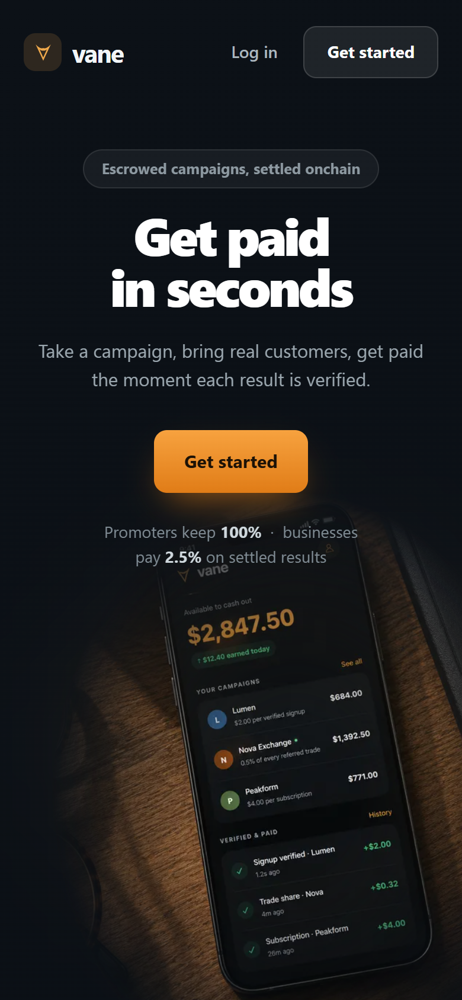
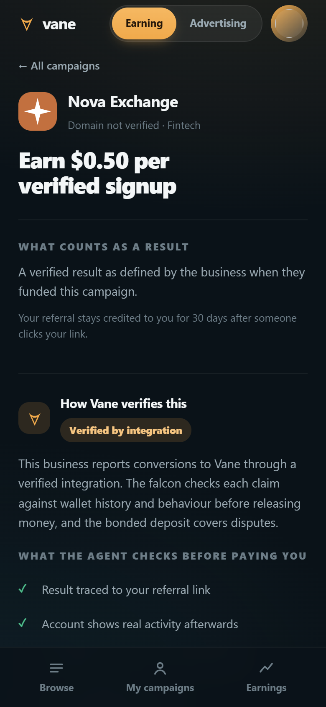
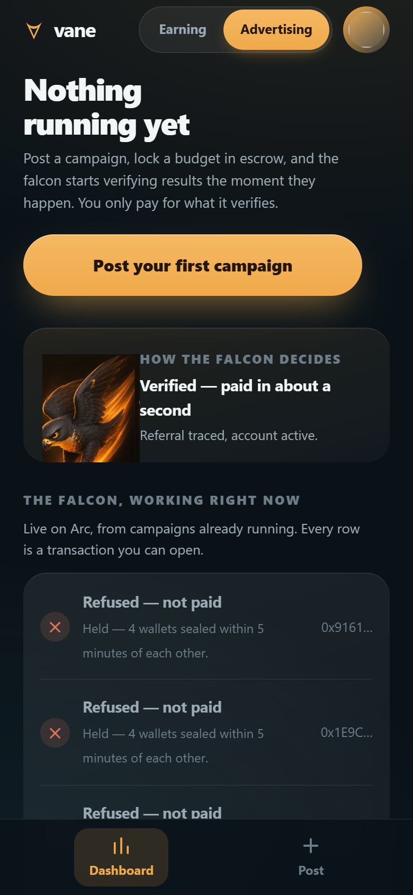

# Vane

[](https://github.com/Vane-app/vane/actions/workflows/ci.yml)
[](https://testnet.arcscan.app/address/0xbd0e454eae86cc605f9e1fe68dc238547a568b2f)
[](https://vane-phi.vercel.app)
[](LICENSE)

**A performance marketing marketplace on Arc, where an autonomous agent replaces the middleman.** Businesses lock a USDC campaign budget in escrow and post the result they will pay for. Anyone can earn it — a person, or an autonomous agent.

The falcon verifies every claimed result against on-chain evidence and settles in about a second: paying honest work, refusing fraud with a written reason published on-chain, and returning unspent budget automatically. It can judge, but it can never touch the money — the payee is fixed by the contract before the work happens.

No human approval, no Net-60 wait, no 30% network fee.

Built for the Programmable Money Hackathon. Entered in **Agentic Economy** (primary) and **DeFi**.

---

## Why this needs programmable money

Performance marketing is settled on invoices and trust. Affiliate networks take 20–30%, pay on Net-60 terms, and enforce $50 payout minimums. Businesses pay before they can verify; earners get paid last and can be re-counted or clawed back with no recourse. The entire fee stack exists to referee two parties who cannot trust each other.

Escrowed USDC on a chain with sub-second settlement and USDC-denominated gas makes that referee software:

- **Budgets are locked before work starts**, so a tasker is never promoting on a promise.
- **Payouts are per-result and immediate**, so sub-cent revenue-share is economically possible — a tasker earns every time a referred user trades, not once a month.
- **Unspent budget returns automatically**, permissionlessly, even if Vane disappears.
- **Nobody manages a seed phrase.** Circle Wallets creates a non-custodial MPC wallet behind a PIN; Arc denominates gas in USDC. A non-crypto business completes the whole flow without meeting a crypto concept — and still holds its own keys.

## The loop

```
business funds a campaign  →  tasker claims a referral code  →  referred user converts on-chain
        ↓                                                                    ↓
   USDC locked in escrow                                        registry seals attribution
        ↓                                                                    ↓
        └──────────────  falcon reads the evidence and decides  ←────────────┘
                                        ↓
                    settle in ~1s          or          hold, with a reason
```

## What it looks like

<p align="center">
  
  
  
  
</p>

## Repository

| Path | What it is |
|---|---|
| `contracts/src/VaneEscrow.sol` | Campaign vault. Funds, settles, expires, refunds. Enforces every spending limit. |
| `contracts/src/ReferralRegistry.sol` | On-chain attribution. One-shot, permanent referral seals. |
| `agent/src/decision.ts` | The falcon's judgement — the fraud engine. |
| `agent/src/index.ts` | Watches Arc, judges conversions, settles or holds. |
| `agent/src/pass.ts` | The same judgement as one stateless pass, so a deployment can settle without a daemon. Imported by `/api/cron/settle`. |
| `agent/src/signals.ts` | Reads on-chain evidence from Arc. |
| `agent/src/circle/` | Circle Wallets, Smart Contract Platform, agent-to-agent payments. |
| `agent/src/demo.ts` | The decision engine, runnable offline in 5 seconds. |
| `app/` | Next.js front end — business and tasker experiences. |
| `contracts/scripts/registry-test.ts` | The referral-hijack attack, run against a local chain. |
| `scripts/mobile-audit.mjs` | Both journeys walked on a real browser at three phone widths. |
| `docs/` | How the product is meant to work, and how it got here. |

## Run it

The decision engine runs with no keys, no chain and no network:

```bash
npm install
npm run demo
```

You will see four scenarios judged: a real referral paid, a sybil farm refused with seven reasons, a brand-new tasker correctly *not* punished for being new, and a wallet cluster flagged by pattern.

The contracts are tested on a throwaway local chain — no keys, no testnet USDC, no Circle
account. It deploys the escrow and registry, runs the referral-hijack attack against
them, and settles a verified result end to end:

```bash
anvil &                              # any local EVM on :8545
npm run test -w @vane/contracts
```

Both journeys are walked on a real browser at three phone widths — sign in, browse, open
a campaign, switch sides, post a campaign — measuring what a stylesheet cannot tell you:
whether a page scrolls sideways, whether a control is too small to hit, whether any text
is too small to read.

```bash
npm run app                          # or point it at a deployment
npm run mobile
```

Compile and deploy the contracts to Arc:

```bash
cp .env.example .env         # fill in Circle credentials
npm run compile -w @vane/contracts
npm run deploy  -w @vane/contracts
```

Run the live agent:

```bash
npm run agent
```

## Trying the deployed app

**[vane-phi.vercel.app](https://vane-phi.vercel.app)** — Arc testnet, so the USDC is test USDC. Everything else is real.

Two browsers, because nobody may convert their own referral link.

1. **Sign in.** A six-digit code by email. Or *"look around with a guest account"* — an address at `demo.vane`, which is not a real TLD and can receive no mail, so the code is shown on screen. Every guest gets their own account and their own wallet; a shared one would die at the first PIN, since Circle's keyshare belongs to whoever set it.
2. **Create a wallet.** The PIN is set inside Circle's window. Vane never sees it and cannot complete this step for anyone.
3. **Take a campaign.** This claims a referral code in `ReferralRegistry` — the tasker's transaction, signed with their PIN. Refused without a wallet, because a referral nobody can seal is a referral nobody can be paid for.
4. **Open the link in the second browser**, sign in, and complete the action. That calls `DemoBusiness.convert`, which stands in for the business's own product: in production the business's backend or contract reports the result. The transaction, the events and everything after them are production code.
5. **Watch the verdict.** Risk score, reason, and every signal the falcon weighed — then USDC moves from escrow to the tasker.

Only funded campaigns appear in the marketplace. A campaign whose budget was never locked on Arc stays visible to its owner and nowhere else, so nothing in the feed can fail to pay.

Settlement runs from `/api/cron/settle`, triggered by the conversion that needs it and by a daily cron as a backstop. It holds no state between runs — a claim's idempotency key is derived from campaign, wallet and action index, so re-reading a block window is free of consequence and can never pay twice.

## Circle and Arc stack

| Product | How Vane uses it |
|---|---|
| **Arc** | All contracts and settlement. Chain `5042002`, USDC-denominated gas, sub-second finality. |
| **USDC** | Campaign budgets, payouts, fees. Held in the 6-decimal ERC-20 view throughout. |
| **Circle Wallets** (user-controlled) | Taskers and businesses. Non-custodial MPC — Vane cannot move their funds. A PIN set inside Circle's own window, never seen by us, and no seed phrases ever. Circle's email OTP is implemented in `app/lib/circle-user.ts` and `CircleLogin.tsx`; sign-in currently uses Vane's own codes, one switch away. |
| **Circle Wallets** (developer-controlled) | The falcon's own operating wallet only. It must act autonomously, and it holds no user money. |
| **Circle Smart Contract Platform** | Deploys and reads the vault and registry. No private key on disk. |
| **Circle Compliance Engine** | Address screening inside the falcon's judgement. Answers the half our own engine cannot: heuristics tell a farm from an audience, but only a registry knows an address is sanctioned. A prohibited match is a gate, not a score — no amount of genuine-looking behaviour makes it payable. Live on `ARC-TESTNET`. |
| **Circle Nanopayments** (Gateway) | Gas-free USDC down to $0.000001 via x402 + EIP-3009, batched offchain. Supported on Arc Testnet, and user wallets are `EOA` so it stays available. *Spec'd in [`docs/ROUTE.md`](docs/ROUTE.md) §7b, not yet built.* |
| **`settleBatch`** | Our own on-chain batching in `VaneEscrow.sol`. Not a Circle product — many escrow payouts amortised into one transaction. Proven: 12 sub-cent payouts, one transaction. |
| **CCTP** | Arc domain `26`. Cross-chain campaign funding — designed for, deliberately not in the MVP. |

## Trust model

The agent is powerful enough to be useful and too weak to be dangerous. This is enforced in the contract, not in the agent's code.

- **The vault holds the money.** The agent never custodies user funds.
- **Neither does Vane.** Taskers and businesses hold **user-controlled** Circle wallets — MPC, non-custodial, keyshare never reaches our servers. Vane cannot move a user's balance. Only the falcon's own operating wallet is developer-controlled, and it holds nothing but Vane's own money.
- **The agent cannot choose a payee.** `settle()` derives the recipient from the referral seal recorded *before* the conversion. There is no arbitrary-recipient path, so a stolen agent key cannot drain a budget — the worst case is paying a genuinely attributed tasker early.
- **Amounts are capped in the contract.** Per-payout by `rewardPerAction`, total by the funded budget.
- **Refunds are permissionless.** After `endsAt`, anyone can return unspent budget to the business. The business's money comes home even if Vane is gone.
- **Settlement is idempotent.** Keyed on `(campaign, wallet, actionIndex)` on-chain and by a deterministic idempotency key at the Circle API. A retry can never double-pay.
- **Refusals are on-chain.** `hold()` emits the agent's written reason so businesses audit the agent rather than trusting it.

## Verification — what is and is not trustless

Being precise about this matters more than claiming more than we can prove.

- **Tier 1 — on-chain conversions.** A referred wallet performs an action on the business's contract. Attribution is sealed on-chain before the conversion, the event is public, and nothing is self-reported. **Genuinely trustless.** This is the MVP.
- **Tier 2 — API-verified conversions.** A Web2 business reports conversions through an integration. The report is the business's own claim, so this is *protected*, not trustless: bonded deposits, agent anomaly detection, and portable reputation constrain it. We do not describe this as cryptographic proof.
- **Tier 3 — judgement-based work.** Roadmap. Not built, not claimed.

## Fraud engine

`agent/src/decision.ts` scores every claim against on-chain signals before money moves:

- time between referral seal and conversion — scripted flows convert faster than humans
- wallet history and age at conversion time
- activity *after* converting — real users keep using the product; sybils go silent
- per-tasker velocity
- funding concentration across a tasker's referred wallets
- the tasker's own settled/held record
- cluster detection across a batch — the pattern is evidence no single wallet reveals
- **Circle Compliance Engine screening** — sanctions and illicit-activity risk on the converting address

The last one is different in kind from the rest, and treated differently. Everything above it is behavioural: evidence about whether a result is genuine, weighed against other evidence. A sanctions match is not evidence, it is a prohibition — so it gates rather than scores, and no amount of genuine-looking history makes the payout allowed. Screening being unavailable is recorded as unavailable, never as clean.

Deterministic checks decide the overwhelming majority of cases, which keeps cost and latency flat as volume grows. Every rule returns one sentence a business would understand; a rule that cannot explain itself does not ship.

## Business model

**2.5% of settled results. The only fee Vane takes.** No listing fees, no subscriptions, no payout fees, no spread.

- Taskers keep 100% of the posted rate. The number on the card is the number that lands.
- The fee is charged to the business, on settled results only, and is enforced in the contract with a hard 10% ceiling.
- Vane earns only when a business receives a verified result and a tasker gets paid.

## Status

- [x] Escrow vault and referral registry, compiling
- [x] Fraud decision engine with written reasoning
- [x] Circle Wallets, Smart Contract Platform and agent-payment integrations
- [x] Offline demo of the decision engine
- [x] Contracts deployed and verified on Arc testnet
- [x] End-to-end settlement on Arc — real USDC, reproducible via `npm run e2e`
- [x] On-chain refusal of a real sybil farm, with an enforced honest control
- [x] Autonomous tasker agent — a machine earning USDC per verified result
- [x] Streaming rev-share via `settleBatch` — 12 sub-cent payouts in one transaction
- [x] User-controlled wallets: taskers and businesses hold their own keys, and sign their own on-chain actions
- [x] The falcon's real decisions read off Arc and shown in the app, each linking to its transaction
- [x] Campaigns posted in the app bind to their on-chain escrow id, and confirm against the chain
- [x] Deployed publicly — [vane-phi.vercel.app](https://vane-phi.vercel.app), settling from a cron on Arc
- [ ] Circle Nanopayments for streaming rev-share campaigns
- [ ] Conversion intake wired to the live registry
- [ ] A durable decision index, so the dashboard survives a cold start without re-scanning

## Network

| | |
|---|---|
| Chain ID | `5042002` |
| RPC | `https://rpc.testnet.arc.network` |
| Explorer | `https://testnet.arcscan.app` |
| USDC | `0x3600000000000000000000000000000000000000` (6 dp ERC-20 view) |
| Faucet | `https://faucet.circle.com` |

## Deployed contracts

Live on Arc testnet. `npm run verify -w @vane/contracts` reads them back and checks the wiring.

| Contract | Address |
|---|---|
| `VaneEscrow` | [`0xbd0e454eae86cc605f9e1fe68dc238547a568b2f`](https://testnet.arcscan.app/address/0xbd0e454eae86cc605f9e1fe68dc238547a568b2f) |
| `ReferralRegistry` | [`0xdbc26d63000774e913938d87264e4d3d699a1463`](https://testnet.arcscan.app/address/0xdbc26d63000774e913938d87264e4d3d699a1463) |
| `DemoBusiness` | [`0xa2e7cb4385d8f1fa77a8c33ff294b67b7728b900`](https://testnet.arcscan.app/address/0xa2e7cb4385d8f1fa77a8c33ff294b67b7728b900) |
| The falcon | [`0xc1a6d325c91bff08906acee76023effc7f70a5ed`](https://testnet.arcscan.app/address/0xc1a6d325c91bff08906acee76023effc7f70a5ed) |

First settlement on this deployment:
[`0x38f197dc…eccf`](https://testnet.arcscan.app/tx/0x38f197dccc0b6a7b4973518f7c94d7439eb6fbc604ae92132f8edd2a37eccfb6)
— $0.50 to the tasker, $0.0125 fee, against a referral sealed on-chain before the
conversion.

## Run it against the live chain

Four commands, four claims, each independently checkable on the explorer.

```bash
npm run e2e    -w @vane/contracts   # the loop: fund → refer → convert → settle
npm run sybil  -w @vane/agent       # the refusal: a real sybil farm, refused on-chain
npm run tasker -w @vane/agent       # a machine takes work and is paid for it
npm run nano   -w @vane/agent       # streaming rev-share: 12 payouts, one transaction
```

**`e2e`** locks USDC in escrow, claims a referral code, converts a referred wallet, and
settles. The tasker receives the full posted rate; the fee comes out of the business's
budget, not the payout.

**`sybil`** builds an actual fraud pattern — one funder, several fresh wallets, all
sealed and converting together — and lets the decision engine judge it. It refuses all
of them and writes the reasons on-chain. The same run then re-judges an honest referral
as a control and **exits non-zero if that control is ever refused**, so the engine cannot
quietly become one that refuses everything.

**`tasker`** is the one that is hard to copy. An autonomous agent with its own wallet
reads the open campaign feed, prices each campaign, claims a code, brings customers, and
is paid per verified result — then reports its own profit and loss. No human approves any
step, and it is judged by exactly the same engine as a human tasker.

**`nano`** settles twelve sub-cent payouts in a single `settleBatch`. The output reports
gas as a percentage of the payout rather than claiming it is free — at $0.002 per action
it is 77%, which is the honest number. Batching is what makes payouts that small possible
at all; no card or bank rail can move $0.002 at any batch size, which is precisely why
affiliate networks impose $50 minimums and monthly cycles.

The same engine scored the sybil farm **80/100 → refused** and the agent's customers
**25/100 → paid**, in consecutive runs against the same contracts.

Every decision either command produces is then readable in the app: the business
dashboard reads `Settled` and `Held` events straight off Arc, each row linking to the
transaction that recorded it. The refusals are the point — an advertiser's deepest fear
is paying for fraud, and the answer is a list they can verify themselves rather than a
reassurance from us.
